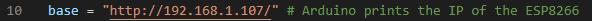
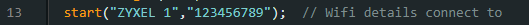

Before starting with the description of the project, we would like to thanks MikelAlda for the help given during the project development.
# Jetson Nano Object detection sensor

In the following lines, you will see the procedure to make inference in the Jetson Nano code we have used.

## Jetson Nano set up
First of all, you have to set up your Jetson Nano, so a good way to get acquainted is to  
go to [this](https://developer.nvidia.com/embedded/learn/get-started-jetson-nano-devkit#intro) step by step tutorial.

## Install dependecies and download packages

The next step is to install the python dependecies. In order to do that, open a terminal an execute the following commands.

```bash
sudo apt-get update
sudo apt-get install python3-pip -y
sudo apt-get install dialog -y # Download the model
sudo apt-get install v4l2loopback-dkms # To display the image
sudo modprobe v4l2loopback
sudo apt-get install nano 
```

## Prepare the docker container

To prepare the docker, we need to clone the repository of jetson inference and enter the jetson_inference folder.
```bash
git clone https://github.com/mikelalda/Blind-eye.git

```

To clone the jetson-inference repository, use the next command:

```bash
git clone https://github.com/dusty-nv/jetson-inference.git


```

Each time you want to run the container, follow the next code:

```bash
cd jetson-inference
docker/run.sh --volume /home/donbosco/jetson-inference/Blind-eye/:/Blind-eye #You must use your own computer path.
```

## Run inference

In the file "Blind-Eye/main.py", we need to change the ESP8266 IP address in line 10. You can see the Blind-Eye instalation process by clicking [this](https://github.com/ElektronikaDonBosco/Blind-Eye) guide.




It may be necessary to change the Wi-Fi of the ESP8266 in line 13 of the Jetson Nano code.



Once we have done all the steps, run this in the docker terminal.
 
```bash
cd /Blind-eye/
python3 main.py
```
